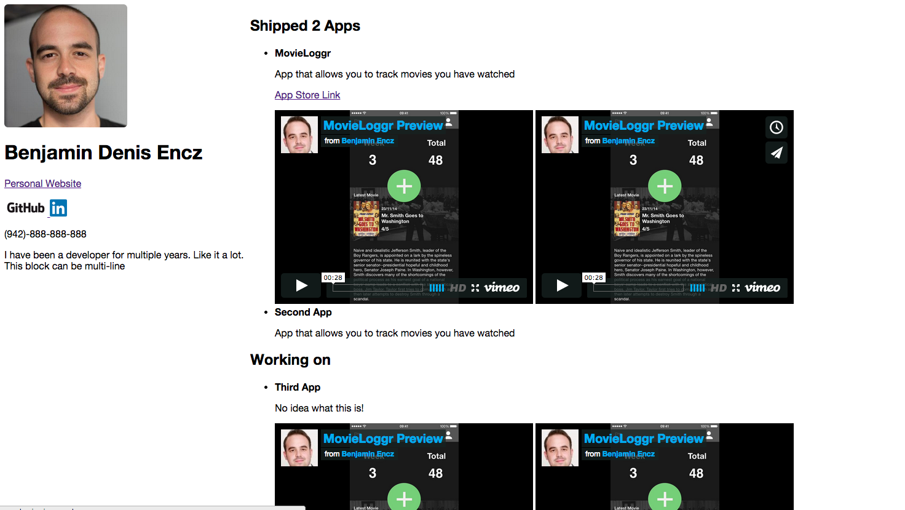

#Create your Student Profile in YAML

##Naming Conventions

Name your folder:

	firstname_lastname

Include the following files in the folder:

- `firstname_lastname.yaml`, contains all info about you
- a picture of you as `jpeg` or `png` 
- your resume in `pdf` format

##YAML Content

This is an example YAML file:

	name: Benjamin Denis Encz
	website: //www.benjamin-encz.de
	github: Ben-G
	linkedin: //www.linkedin.com/in/benjaminencz/
	picture: profile.jpeg
	resume: resume_encz.pdf
	phone: (942)-888-888-888
	about: |
	    I have been a developer for multiple years. Like it a lot.
	    This block can be multi-line
	apps:
	  - title: MovieLoggr
	    about: App that allows you to track movies you have watched
	    preview_video_url: //player.vimeo.com/video/116390281
	    tech_talk_video_url: //player.vimeo.com/video/116390281
	    link_description: App Store Link
	    link_target: https://itunes.apple.com/us/app/movieloggr/id914426090?mt=8
	  - title: Second App
	    about: App that allows you to track movies you have watched
	works_on:
	  - title: Third App
	    about: No idea what this is!
	    preview_video_url: //player.vimeo.com/video/116390281
	    tech_talk_video_url: //player.vimeo.com/video/116390281
	    
- **name** required 
- **website** required
- **github** GitHub username, required
- **linkedin** Link to your LinkedIn profile
- **picture** filename of the profile picture you have added to your folder
- **resume** filename of the resume you have added to your folder
- **phone** phone number required
- **about** brief description about yourself
- **apps** a list of apps you **have shipped**
- **works_on** a list of apps you are working on

###YAML Content per App

Each app can contain the following fields:

- **title** required
- **about** required brief description of your project
- **preview_video_url** URL to video on **Vimeo** describing the functionality of your app
- **tech_talk_video_url** URL to video on **Vimeo** describing the technical aspects of your app
- **link_description** title of the link to your project, e.g. "App Store Link", "Demo Site Link"
- **link_target** Link to your App, either App Store or Website

#Before uploading your resume, run it through a [YAML linter](http://www.yamllint.com/) to see if your file is valid!

Result will look similar to this, just a lot nicer (more CSS):

 
